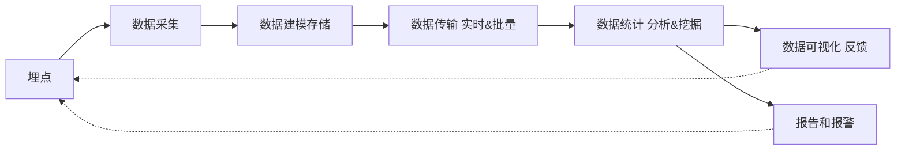

# 前端监控

## 1.前端监控的原因

- 更快发现问题和解决问题
- 做产品的决策依据
- 提升前端工程师的技术深度和广度，打造简历亮点
- 为业务扩展提供更多可能性

## 2.前端监控目标

1. 稳定性 stability

| 错误名称 | 备注                         |
| -------- | ---------------------------- |
| js 错误  | js 执行错误或者 promise 异常 |
| 资源错误 | script、link 等资源加载异常  |
| 接口错误 | ajax 或 fetch 请求接口异常   |
| 白屏     | 页面空白                     |

2. 用户体验 experience

| 名称                                      | 备注                                                         |
| ----------------------------------------- | ------------------------------------------------------------ |
| 加载时间                                  | 各个阶段的加载时间                                           |
| TTFB(time to first byte)首字节时间        | 浏览器发起第一个请求到数据返回第一个字节所消耗的时间，这个时间包含了网络请求时间、后端处理时间 |
| FP(First Paint)首次绘制                   | 包括任何用户自定义的背景绘制，它是将第一个像素点绘制到屏幕的时刻 |
| FCP(First Content Paint)首次内容绘制      | 浏览器将第一个 DOM 渲染到屏幕的时间，可以是任何文本、图像、SVG 等内容的时间 |
| FMP(First Meaningful Paint)首次有意义绘制 | 是页面可用性的量度标准                                       |
| FID(First Input Delay)首次输入延迟        | 用户首次和页面交互到页面响应交互的时间                       |
| 卡顿                                      | 超过 50ms 的长任务                                           |

3. 业务 business

| 名称           | 备注                             |
| -------------- | -------------------------------- |
| PV             | page view 页面浏览量或点击量     |
| UV             | 访问某个站点的不同 IP 地址的人数 |
| 页面的停留时间 | 用户在每一个页面的停留时间       |


## 3.前端监控流程

- 前端埋点
- 数据上报
- 分析和计算 将采集道德数据进行加工汇总
- 可视化展示 将数据按各种维度进行展示
- 监控报警 发现问题后按一定的条件触发报警



前端需要关注的：埋点、数据采集


### 常见的埋点方案

1. 代码埋点

- 以嵌入代码的形式进行埋点，比如需要监控用户的点击事件，会选择在用户点击是，插入一段代码，保存这个监听行为或者直接将监听行为以某一种数据格式直接传递给服务器端
- 优点：可以在任意时刻，精确的发送或保存所需要的数据信息
- 缺点：工作量较大

2. 可视化埋点

- 通过可视化交互的手段，代替代码埋点
- 将业务代码和埋点代码分离，提供一个可视化交互的页面，输入为业务代码，通过这个可视化系统，可以在业务代码中自定义的增加埋点事件等等，最后数据的代码耦合了业务代码和埋点代码
- 可视化埋点就是用系统来代替手工插入埋点代码

3. 无痕埋点

- 前端的任意一个事件都被绑定一个标识，所有的事件都被记录下来
- 通过定期上传记录文件，配合文件解析，解析出来想要的数据，生成可视化报告供专业人员分析
- 优点：采集全量数据，不会出现漏埋和误埋等现象
- 缺点：给数据传输和服务器增加压力，也无法灵活定制数据结构


## 4.编写监控采集脚本

### 开通日志服务

- 日志服务（Log Service 简称 SLS）是针对日志类数据一站式服务，用户无需开发就能快捷完成数据采集、消费、投递以及查询分析等功能，帮助提升运维、运营效率，建立 DT 时代海量日志处理能力
- 日志服务帮助文档
- Web Tracking

### 4.1 监控错误

#### 错误分类

- JS 错误
  - JS 错误
  - Promise 异常
- 资源异常
  - 监听 error

#### 数据结构设计

1. jsError

```js
{
  "title": "前端监控系统", // 页面标题
  "url": "http://localhost:8080", // 页面URL
  "timestamp": "1653839212233", // 访问时间戳
  "userAgent": "Chrome", // 用户浏览器类型
  "kind": "stability", // 大类
  "type": "error", // 小类
  "errorType": "jsError", // 错误类型
  "message": "Uncaught TypeError: Cannot set property 'error' of undefined", // 类型详情
  "filename": "http://localhost:8080/", // 访问的文件名
  "position": "0:0", // 行列信息
  "stack": "btnClick (http://localhost:8080/:20:39)^HTMLInputElement.onclick (http://localhost:8080/:14:72)", // 堆栈信息
  "selector": "HTML BODY #container .content INPUT" // 选择器
}
```


2. promiseError

```js
{
  "title": "前端监控系统", // 页面标题
  "url": "http://localhost:8080", // 页面URL
  "timestamp": "1653839212233", // 访问时间戳
  "userAgent": "Chrome", // 用户浏览器类型
  "kind": "stability", // 大类
  "type": "error", // 小类
  "errorType": "promiseError", // 错误类型
  "message": "someVar is not defined", // 类型详情
  "filename": "http://localhost:8080/", // 访问的文件名
  "position": "24:29", // 行列信息
  "stack": "http://localhost:8080/:24:29^new Promise (<anonymous>)^btnPromiseClick (http://localhost:8080/:23:13)^HTMLInputElement.onclick (http://localhost:8080/:14:72)", // 堆栈信息
  "selector": "HTML BODY #container .content INPUT" // 选择器
}
```


3. resourceError

```js
{
  "title": "前端监控系统",
  "url": "http://localhost:8080",
  "timestamp": "1653839212233",
  "userAgent": "Chrome",
  "kind": "stability",
  "type": "error",
  "errorType": "resourceError",
  "filename": "http://localhost:8080/someError.js",
  "tagName": "SCRIPT",
  "selector": "HTML BODY SCRIPT"
}
```


### 4.2 监控接口

#### 数据结构设计

```js
{
  "title": "前端监控系统", // 标题
  "url": "http://localhost:8080/", // url
  "timestamp": "1653839212233", // timestamp
  "userAgent": "Chrome", // 浏览器版本
  "kind": "stability", // 大类
  "type": "xhr", // 小类
  "eventType": "load", // 事件类型
  "pathname": "/success", // 路径
  "status": "200-OK", // 状态码
  "duration": "7", // 持续时间
  "response": "{\"id\":1}", // 响应内容
  "params": "" // 参数
}
```

例如

```js
{
  "title": "前端监控系统", // 标题
  "url": "http://localhost:8080/", // url
  "timestamp": "1653839212233", // timestamp
  "userAgent": "Chrome", // 浏览器版本
  "kind": "stability", // 大类
  "type": "xhr", // 小类
  "eventType": "load", // 事件类型
  "pathname": "/error", // 路径
  "status": "500-Internal Server Error", // 状态码
  "duration": "7", // 持续时间
  "response": "", // 响应内容
  "params": "name=zhangsan" // 参数
}
```


### 4.3 监控白屏

#### 数据结构设计

```js
{
  "title": "前端监控系统", // 标题
  "url": "http://localhost:8080/", // url
  "timestamp": "1653839212233", // timestamp
  "userAgent": "Chrome", // 浏览器版本
  "kind": "stability", // 大类
  "type": "blank", // 小类
  "emptyPoints": "0", // 空白点
  "screen": "3840x2160", // 分辨率
  "viewPoint": "3840x2160", // 视口
  "selector": "HTML BODY #container" // 选择器
}
```

#### 实现要点

- screen 返回当前 window 的 screen 属性对象，返回当前渲染窗口中和屏幕有关的属性
- innerWidth 只读的 Window 属性 innerWidth 返回以像素为单位的窗口的内部宽度
- innerHeight 窗口的内部高度（布局视口）的高度
- layout_viewport
- elementsFromPoint 方法可以获取到当前视口内指定坐标处，由里到外排列的所有元素


### 4.4 监控加载时间

- PerformanceTiming
- DOMContentLoaded
- FMP

https://github.com/pfan123/Articles/issues/87

#### 阶段含义

| 字段                       | 含义                                                         |
| -------------------------- | ------------------------------------------------------------ |
| navigationStart            | 初始化页面，在同一个浏览器上下文中前一个页面 unload 的时间戳，如果没有前一个页面的 unload，则与 fetchStart 值相等 |
| redirectStart              | 第一个 HTTP 重定向发生的时间，有跳转且是同域的重定向，否则为 0 |
| redirectEnd                | 最后一个重定向完成时的时间，否则为 0                         |
| fetchStart                 | 浏览器准备好使用 http 请求获取文档的时间，发生在检查缓存之前 |
| domainLookupStart          | DNS 域名开始查询的时间，如果有本地的缓存或 keep-alive 则时间为 0 |
| domainLookupEnd            | DNS 域名结束查询的时间                                       |
| connectStart               | TCP 开始建立连接的时间，如果是持久连接，则与 fetchStart 值相等 |
| secureConnectionStart      | https 连接开始的时间，如果不是安全连接，则为 0               |
| connectEnd                 | TCP 完成握手的时间，如果是持久连接则与 fetchStart 值相等     |
| requestStart               | HTTP 请求读取真实文档开始的时间，包括从本地缓存读取          |
| requestEnd                 | HTTP 请求读取真实文档结束的时间，包括从本地缓存读取          |
| responseStart              | 返回浏览器从服务器收到（或从本地缓存读取）第一个字节时的 Unix 毫秒时间戳 |
| responseEnd                | 返回浏览器从服务器收到（或从本地缓存、本地资源读取）最后一个字节时的 Unix 毫秒时间戳 |
| unloadEventStart           | 前一个页面的 unload 的时间戳，如果没有则为 0                 |
| unloadEventEnd             | 与 unloadEventStart 相对应，返回的是 unload 函数执行完成的时间戳 |
| domLoading                 | 返回当前网页 DOM 结构开始解析时的时间戳，此时 document.readyState 变成 loading，并将抛出 readyStateChange 事件 |
| domInteractive             | 返回当前网页 DOM 结构结束解析、开始加载内嵌资源时的时间戳，document.readyState 变成 interactive，并将抛出 readyStateChange 事件（注意：只是 DOM 树解析完成，此时并没有开始加载网页内的资源） |
| domContentLoadedEventStart | 网页 domContentLoaded 事件发生的时间                         |
| domContentLoadedEventEnd   | 网页 domContentLoaded 事件脚本执行完毕的时间，domReady 的时间 |
| domComplete                | DOM 树解析完成，且资源也准备就绪的时间，document.readyState 变成 complete，并将抛出 readyStateChange 事件 |
| loadEventStart             | load 事件发送给文档，也就是 load 回调函数开始执行的时间      |
| loadEventEnd               | load 回调函数执行完成的时间                                  |


#### 阶段计算

| 字段             | 描述                                  | 计算方式                                              | 意义                                                         |
| ---------------- | ------------------------------------- | ----------------------------------------------------- | ------------------------------------------------------------ |
| unload           | 前一个页面卸载耗时                    | unloadEventEnd - unloadEventStart                     | -                                                            |
| redirect         | 重定向耗时                            | redirectEnd - redirectStart                           | 重定向的时间                                                 |
| appCache         | 缓存耗时                              | domainLookupStart - fetchStart                        | 读取缓存的时间                                               |
| dns              | DNS 解析耗时                          | domainLookupEnd - domainLookupStart                   | 可观察域名解析服务是否正常                                   |
| tcp              | TCP 连接耗时                          | connectEnd - connectStart                             | 建立连接的耗时                                               |
| ssl              | SSL 安全连接耗时                      | connectEnd - secureConnectionStart                    | 反映数据安全连接建立耗时                                     |
| ttfb             | Time to First Byte(TTFB) 网络请求耗时 | responseStart - requestStart                          | TTFB 是发出页面请求到接收到应答数据第一个字节所花费的毫秒数  |
| response         | 响应数据传输耗时                      | responseEnd - responseStart                           | 观察网络是否正常                                             |
| dom              | DOM 解析耗时                          | domInteractive - responseEnd                          | 观察 DOM 结构是否合理，是否有 JS 阻塞页面解析                |
| dcl              | DOMContentLoaded 事件耗时             | domContentLoadedEventEnd - domContentLoadedEventStart | 当 HTML 文档被完全加载和解析完成之后，DOMContentLoaded 事件被触发，无需等待样式表、图像和子框架的完成加载 |
| resources        | 资源加载耗时                          | domComplete - domContentLoadedEventEnd                | 可观察文档流是否过大                                         |
| domReady         | DOM 阶段渲染耗时                      | domContentLoadedEventEnd - fetchStart                 | DOM 树和页面资源加载完成时间，会触发 domContentLoaded 事件   |
| 首次渲染耗时     | 首次渲染耗时                          | responseEnd - fetchStart                              | 加载文档到看到第一帧非空图像的时间，也就是白屏时间           |
| 首次可交互时间   | 首次可交互时间                        | domInteractive - fetchStart                           | DOM 解析完成时间，此时 document.readyState 为 interactive    |
| 首包时间耗时     | 首包时间                              | responseStart - domainLookupStart                     | DNS 解析到响应返回给浏览器第一个字节的时间                   |
| 页面完全加载时间 | 页面完全加载时间                      | loadEventStart - fetchStart                           |                                                              |
| onLoad           | onLoad 事件耗时                       | loadEventEnd - loadEventStart                         |                                                              |


#### 数据结构设计

```js
{
  "title": "前端监控系统", // 标题
  "url": "http://localhost:8080/", // url
  "timestamp": "1653839212233", // timestamp
  "userAgent": "Chrome", // 浏览器版本
  "kind": "experience", // 大类
  "type": "timing", // 小类
  "connectTime": "0",
  "ttfbTime": "1",
  "responseTime": "1",
  "parseDOMTime": "80",
  "domContentLoadedTime": "0",
  "timeToInteractive": "88",
  "loadTime": "89"
}
```


### 4.5 性能指标

- PerformanceObserver.observe 返回用于观察传入的参数中，指定的性能条目类型的集合。当记录一个指定类型的性能条目时，性能监测对象的回调函数将会被触发
- entryType
- paint-timing
- event-timing
- LCP
- FMP
- time-to-interactive

#### 指标含义

| 字段 | 描述                                  | 备注                                                         |
| ---- | ------------------------------------- | ------------------------------------------------------------ |
| FP   | First Paint 首次绘制                  | 包括了任何用户自定义的背景绘制，是指首先将像素绘制到屏幕的时刻 |
| FCP  | First Contentful Paint 首次内容绘制   | 是浏览器将第一个 DOM 渲染到屏幕的时间，可能是文本、图像、SVG 等，这其实就是白屏时间 |
| FMP  | First Meaningful Paint 首次有意义绘制 | 页面有意义的内容渲染的时间                                   |
| LCP  | Largest Contentful Paint 最大内容渲染 | 代表在 viewport 中最大的页面元素加载的时间                   |
| DCL  | DomContentLoaded DOM 加载完成         | 当 HTML 文档被完全加载和解析完成之后，DOMContentLoaded 事件被触发，无需等待样式表、图像和子框架的完成加载 |
| L    | onLoad                                | 当依赖的资源全部加载完毕之后才会触发                         |
| TTI  | Time to Interactive 可交互时间        | 用于标记应用已进行视觉渲染并能可靠响应用户输入的时间点       |
| FID  | First Input Delay 首次输入延迟        | 用户首次和页面交互（单击链接、点击按钮等）到页面响应交互的时间 |


#### 数据结构设计

- paint

```js
{
  "title": "前端监控系统", // 标题
  "url": "http://localhost:8080/", // url
  "timestamp": "1653839212233", // timestamp
  "userAgent": "Chrome", // 浏览器版本
  "kind": "experience", // 大类
  "type": "paint", // 小类
  "firstPaint": "102",
  "firstContentPaint": "2130",
  "firstMeaningfulPaint": "2130",
  "largestContentfulPaint": "2130"
}
```

- firstInputDelay

```js
{
  "title": "前端监控系统", // 标题
  "url": "http://localhost:8080/", // url
  "timestamp": "1653839212233", // timestamp
  "userAgent": "Chrome", // 浏览器版本
  "kind": "experience", // 大类
  "type": "firstInputDelay", // 小类
  "inputDelay": "3",
  "duration": "8",
  "startTime": "4812.123123123213",
  "selector": "HTML BODY #container .content H1"
}
```


### 4.6 卡顿

- 响应用户交互的响应时间如果大于 100ms，用户就会感觉卡顿

#### 数据结构设计

```js
{
  "title": "前端监控系统", // 标题
  "url": "http://localhost:8080/", // url
  "timestamp": "1653839212233", // timestamp
  "userAgent": "Chrome", // 浏览器版本
  "kind": "experience", // 大类
  "type": "longTask", // 小类
  "eventType": "mouseover",
  "startTime": "9331",
  "duration": "200",
  "selector": "HTML BODY #container .content"
}
```


### 4.7 pv

- netinfo
- RTT(Round Trip Time) 一个连接的往返时间，即数据发送时刻到接收到确认的时刻的差值
- navigator.sendBeacon() 方法可用于通过 HTTP 将少量数据差异传输到 Web 服务器

#### 数据结构设计

```js
{
  "title": "前端监控系统", // 标题
  "url": "http://localhost:8080/", // url
  "timestamp": "1653839212233", // timestamp
  "userAgent": "Chrome", // 浏览器版本
  "kind": "business", // 大类
  "type": "pv", // 小类
  "effectiveType": "4g",
  "rtt": "50",
  "screen": "2049x1152"
}
```

